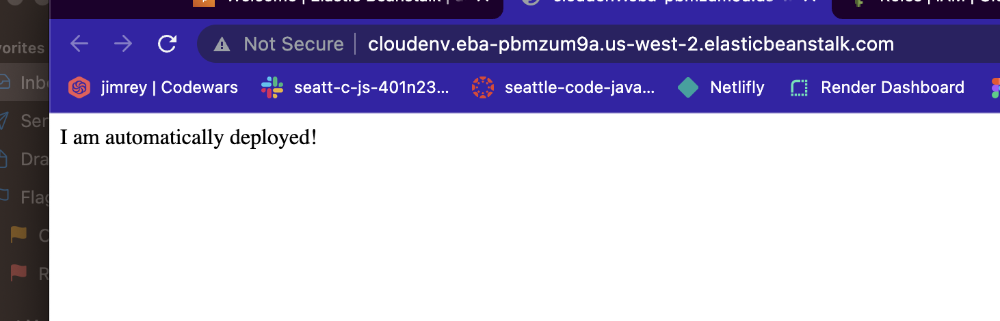

# process

create amazon account
go to elastic beanstalk
applications
create application - name it
create new environemnt (you have to create the environment in the terminal the first time)
choose the platform
skip to the end and create/deploy.
Takes about 5 minutes and then you should be good.
